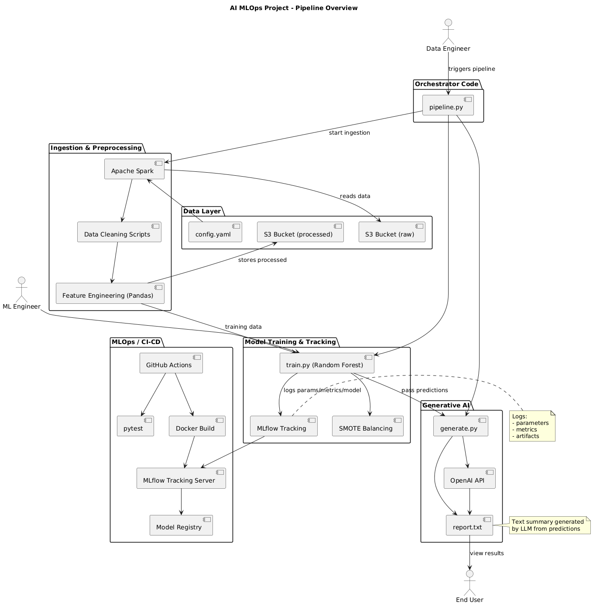
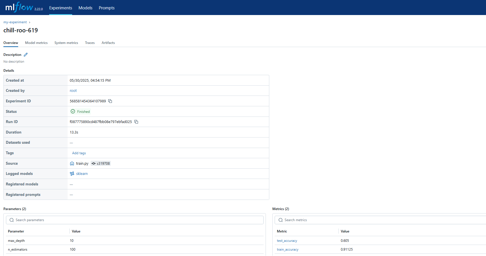
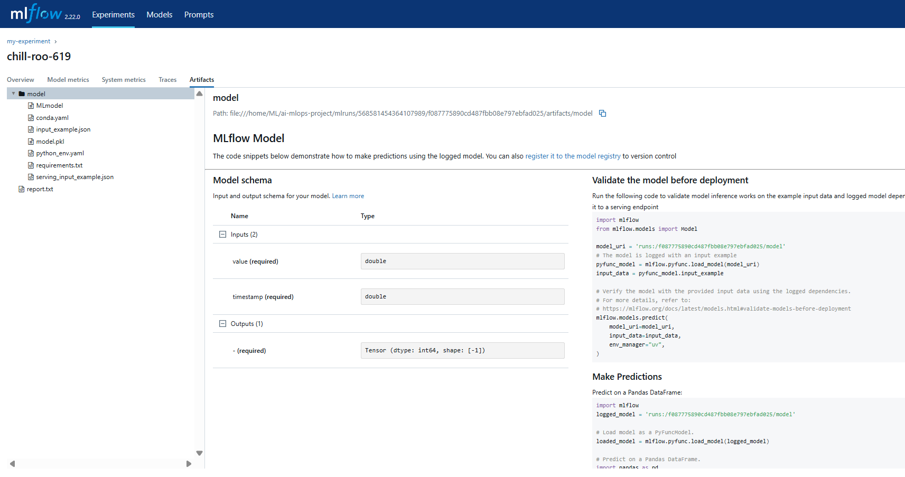

# AI MLOps Project

[](https://www.python.org/)
[](https://spark.apache.org/)
[](https://www.docker.com/)
[](https://mlflow.org/)
[](https://openai.com/)
[](https://github.com/impesud/ai-mlops-project/actions/workflows/ci-cd.yml)
[](https://github.com/impesud/ai-mlops-project/blob/main/LICENSE)
[](https://github.com/impesud/ai-mlops-project/commits/main)
[]()

🚀 **AI MLOps Project** – A production-grade MLOps pipeline combining Big Data processing, scalable training workflows, and LLM-powered analytics.

This end-to-end solution features:  
- Data ingestion from S3 using Apache Spark  
- Model training with full MLflow tracking (parameters, metrics, models, artifacts)  
- Automated data reporting using OpenAI's Generative AI  
- Testing via `pytest`  
- CI/CD workflows powered by GitHub Actions  
- Dockerized deployment pipeline
- Multi-environment support (dev / prod) with configurable pipeline behavior

✅ Fully compatible with Ubuntu + GitHub Actions  
✅ Cloud extensible (AWS, Azure, GCP)  
✅ Docker-ready with automated image build and deployment  
✅ Modular design for fast customization and reuse

---

## 📋 Table of Contents

1. [Model and Training Pipeline](#-model-and-training-pipeline)  
2. [Requirements](#-requirements)  
3. [Ubuntu Setup](#-ubuntu-setup)  
4. [Components](#-components)  
5. [Usage Example](#-usage-example)  
6. [MLflow UI](#-mlflow-ui)  
7. [MLOps and Tracking Server](#-mlops-and-tracking-server)  
8. [Testing](#-testing)  
9. [CI/CD Pipeline](#-cicd-pipeline)  
10. [Next Steps](#-next-steps)  
11. [License](#-license)

---

## 🧭 Architecture Diagram

Here is an overview of the AI MLOps Pipeline:



---

## 🔍 Model and Training Pipeline

Starting from synthetic CSV data (sample_1k.csv for dev or sample_100k.csv for prod), the project performs batch ingestion with Apache Spark, followed by feature engineering in Pandas. The preprocessed data is used to train a Random Forest classifier on a binary classification task: purchase vs. non-purchase.

The model predicts whether each event (e.g., click, signup, purchase) is a purchase. Results are logged with MLflow and analyzed through Generative AI reports powered by OpenAI.

---

## 🔧 Requirements

* **Python** 3.8+ (3.10 or 3.11 recommended)  
* **Java** 8+ (for Apache Spark)  
* **Docker**  
* **MLflow** CLI (`pip install mlflow`)  
* **AWS CLI** / GCP SDK / Azure CLI  
* **Git**  
* **OpenAI API key** (for generative AI)

---

## ⚙️ Ubuntu Setup

1. **Clone the repository**
   ```bash
   git clone https://github.com/impesud/ai-mlops-project.git
   cd ai-mlops-project
   ```

2. **Create and activate virtualenv**
   ```bash
   python3 -m venv venv
   source venv/bin/activate
   pip install --upgrade pip setuptools
   pip install -r requirements.txt
   ```

3. **Configure AWS profile**  
   Edit `~/.aws/config`:
   ```ini
   [<AWS_user>]
   region = eu-central-1
   ```
   Export environment variable:
   ```bash
   export AWS_PROFILE=<AWS_user>
   ```

4. **Set OpenAI key**  
   Add in `~/.bashrc` or `~/.zshrc`:
   ```bash
   export OPENAI_API_KEY="sk-xxxxxxxxxxxxxxxxxxxx"
   ```
   Then run:
   ```bash
   source ~/.bashrc
   ```

5. **Switch mode (dev/prod) and run**  
   Set `dev` or `prod`:
   ```bash
   ./scripts/run_pipeline.sh dev
   ```

---

## 🧩 Components

* `data_ingestion/`: Spark batch/streaming, data cleaning, write to S3/local  
* `data_processing/`: notebooks + transformations  
* `models/`: training (`train.py`), SMOTE, feature engineering, MLflow tracking  
* `scripts/`: orchestrator `pipeline.py` (ingestion, training, AI, logging)  
* `mlops/`: `entrypoint.sh` for MLflow Tracking Server  
* `generative_ai/`: `generate.py` for LLM reports (OpenAI)  
* `.github/workflows/`: CI/CD and automated testing

---

## 🎯 Usage Example

```bash
# Activate virtualenv
source venv/bin/activate

# Run entire pipeline in dev/prod mode
./scripts/run_pipeline.sh dev

# Manually run stages
./scripts/run_ingest.sh
./scripts/run_train.sh

# Generate LLM report (automatically dated)
python generative_ai/generate.py --prompt "Data analysis" 
```

---

## 📊 MLflow UI

Launch MLflow UI:
```bash
mlflow ui --backend-store-uri ./mlruns --port 5000
```

Access: [http://localhost:5000](http://localhost:5000)  
View:
1. Parameters and metrics  
2. Model and signature  
3. `report.txt` artifact generated by LLM




---

## ⚙️ MLOps and Tracking Server

Start MLflow Tracking Server:
```bash
./mlops/entrypoint.sh
```
Access:
```bash
http://localhost:5000
```
Can be used in Docker containers or local networks.

---

## 🧪 Testing

The `test/` folder includes automated tests with `pytest`.

| File             | Validates                                   |
|------------------|---------------------------------------------|
| `test_ingest.py` | Generation of Parquet files                |
| `test_train.py`  | Model logging and artifact in MLflow       |

Run all tests:
```bash
pytest test/
```

---

### 🔁 **CI/CD Pipeline**

The GitHub Actions pipeline executes the following steps:

- ✅ Set up Python environment and install all dependencies  
- 🔄 Run full data ingestion and model training workflow  
- 📊 Track parameters, metrics, models, and artifacts using MLflow  
- 🧪 Execute unit tests with `pytest`  
- ☁️ Upload the trained model artifact to GitHub Actions  
- 🐳 Build and push the Docker image to Docker Hub  
- 📦 Deploy and test the inference endpoint using `mlflow models serve`

---

### ✅ Already Implemented Highlights

- Dev/Prod mode switching via CLI and `config.yaml`
- End-to-end pipeline execution with `pipeline.py`
- MLflow tracking with model signature, metrics, and custom artifacts
- Docker-based setup for CI/CD and local training
- Dynamic LLM report generation with OpenAI and fallback handling

---

### 🚀 **Next Steps**

- 🧠 Advanced feature engineering (hour, weekday, user-level stats)  
- 🎯 Tune model hyperparameters with Optuna/GridSearchCV  
- 📈 Log ROC, precision-recall curves in MLflow  
- 🔐 Enhanced CI/CD with SonarQube and multi-environment pipelines  
- 📡 Model serving via `mlflow models serve` or FastAPI + REST API

---

## 📜 License

MIT © 2025 Erick Jara - Impesud

✍️ Attribution:  
If you use this project, please mention  
"Based on the AI MLOps Project by Erick Jara - Impesud".


